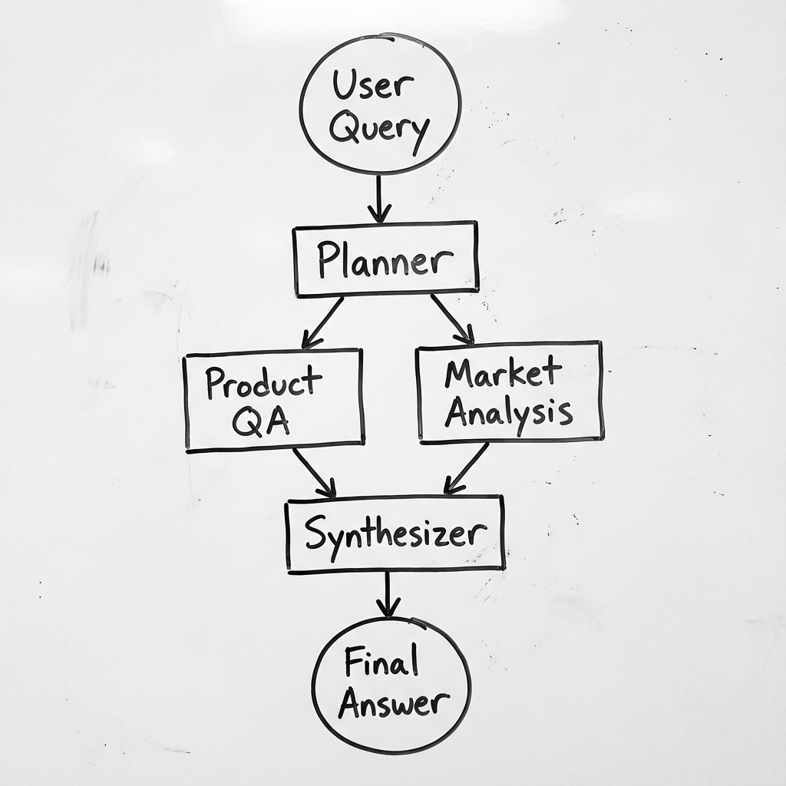
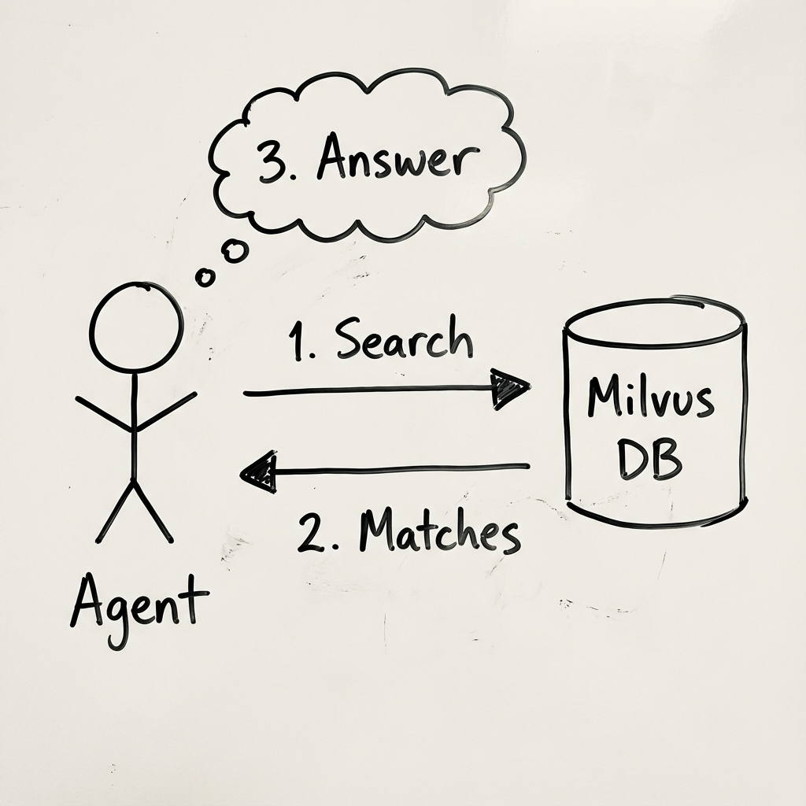

# System Architecture

## Project Structure

```bash
src/
├── domain/                      # 🧠 Core Business Logic (Pure Python)
│   ├── entities.py              # Product, SearchQuery, QueryHistory
│   ├── ports.py                 # IVectorStore, ILLMProvider, ISearchClient
│   ├── exceptions.py            # Domain exceptions
│   └── logger.py                # Logging utilities
│
├── application/                 # 🎮 Orchestration & Use Cases
│   ├── agent/                   # LangGraph Agent System
│   │   ├── graph.py             # Main orchestrator (Planner → Workers → Synthesizer)
│   │   ├── state.py             # Agent state management
│   │   ├── agents/
│   │   │   ├── planner.py       # Query planning agent
│   │   │   ├── product_qa.py    # Product catalog specialist
│   │   │   └── market_analysis.py  # Market research specialist
│   │   ├── tools/
│   │   │   ├── product_rag.py   # Hybrid search tool
│   │   │   ├── web_search.py    # Tavily web search
│   │   │   ├── calculator.py    # Math operations
│   │   │   └── price_analysis.py # Margin calculations
│   │   └── prompts/             # System prompts for each agent
│   │
│   ├── api/                     # FastAPI REST Endpoints
│   │   ├── main.py              # App initialization
│   │   ├── dependencies.py      # Dependency injection
│   │   ├── schemas.py           # Request/Response models
│   │   └── routes/
│   │       ├── query.py         # /query endpoint
│   │       ├── history.py       # /queries endpoint
│   │       ├── feedback.py      # /feedback endpoint
│   │       └── health.py        # /health endpoint
│   │
│   ├── pipeline/                # Data Ingestion Pipeline
│   │   ├── loader.py            # CSV loading
│   │   ├── embedder.py          # Text embedding generation
│   │   └── ingester.py          # Orchestrates ingestion flow
│   │
│   ├── database/                # SQLite Persistence
│   │   ├── models.py            # SQLAlchemy models
│   │   └── repository.py        # Query history CRUD
│   │
│   └── vector_store/
│       └── repository.py        # Milvus operations wrapper
│
├── infrastructure/              # 🔌 External Adapters (Implements Ports)
│   ├── milvus/
│   │   ├── client.py            # Milvus connection
│   │   └── schema.py            # Collection schema definition
│   │
│   ├── openai/
│   │   └── embeddings.py        # OpenAI embedding adapter
│   │
│   ├── llm/
│   │   └── openai.py            # OpenAI LLM adapter
│   │
│   └── search/
│       └── tavily.py            # Tavily search adapter
│
├── cli/
│   └── ingest.py                # CLI for data ingestion
│
└── config/
    └── settings.py              # Environment configuration
```

## High-Level Overview

We're keeping it real simple. We follow **Clean Architecture** and **Domain-Driven Design (DDD)**. 

Basically:
1.  **Domain**: The rules of our business. It doesn't care about databases or APIs.
2.  **Application**: The boss. It tells everyone what to do.
3.  **Infrastructure**: The worker bees. They talk to the outside world (DBs, AI models).

## Agentic Workflow

Instead of one giant brain, we use a team of agents managed by **LangGraph**. A Planner breaks down the user's question and hands off tasks to specialists.



## Data Flow (RAG)

When you search for a product, we don't just guess. We use **Hybrid Search** to pull real data from our Vector DB (Milvus) before answering.


