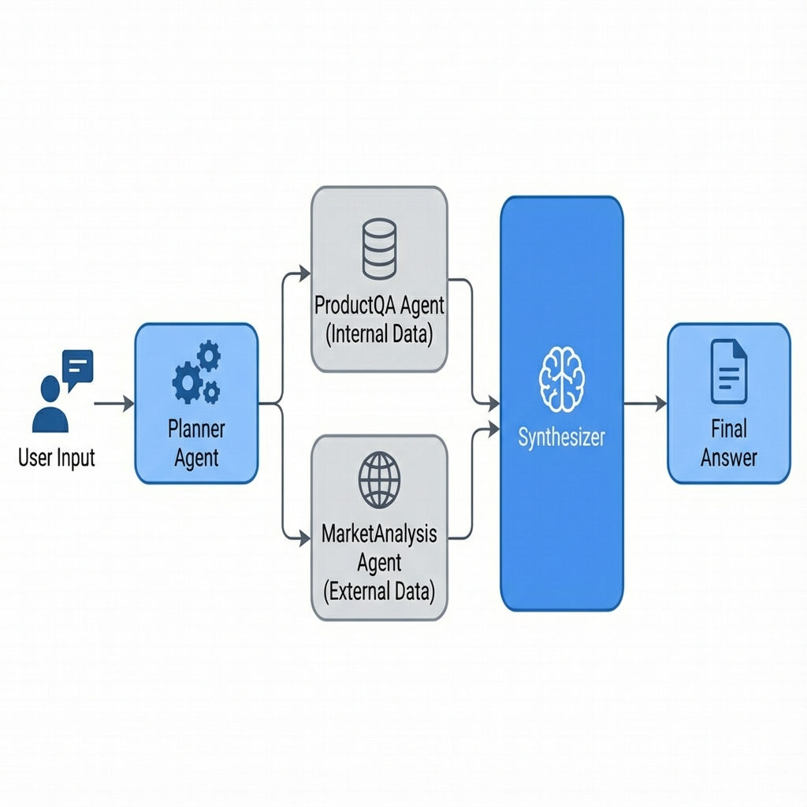

# AI Agent Architecture

## Overview

The AI Agent System in the quanXAI project is designed using the **LangGraph** framework to control state and workflow. It utilizes a **Planner-Worker Architecture**, which allows the Agent to plan complex tasks and clearly separate responsibilities.

---

## Agent Pipeline Flow

The system operates as a Graph that receives a User Query and passes it through various Nodes as follows:



1. **Planner Node**: Analyzes the user's question and creates an "Execution Plan" (sequence of steps).
2. **Worker Nodes**: Accept tasks according to the Plan.
   - **ProductQA**: Answers questions about internal products (Internal Knowledge).
   - **MarketAnalysis**: Analyzes external data (External Knowledge).
3. **Synthesize Node**: Aggregates results from all steps to summarize the final answer.

---

## Core Components

### 1. Planner Agent (`planner.py`)

**Role**: The main brain for "Task Decomposition".
- Receives Query from User
- Checks Chat History
- Creates a work plan (List of steps) specifying which Agent does what.

**Example Plan**:
Query: "Compare Sony headphone prices with market prices."
Plan:
1. `ProductQA`: Search for Sony headphone prices in the database.
2. `MarketAnalysis`: Search for market prices of the same Sony headphone model.
3. `Synthesize`: Synthesize the comparison results.

**Planner Output**:
```json
{
  "reasoning": "User wants to compare our Sony price with market. First step is to get our price, second is to get external price, then compare.",
  "plan": [
    {
      "step": 1,
      "agent": "product_qa",
      "action": "Check price of Sony headphones in our database"
    },
    {
      "step": 2,
      "agent": "market_analysis",
      "action": "Search for market price of Sony headphones"
    },
    {
      "step": 3,
      "agent": "synthesize",
      "action": "Synthesize comparison"
    }
  ]
}
```

### 2. Product QA Agent (`product_qa.py`)

**Role**: Expert on internal organizational product data.
**Tools**:
- **ProductRAGTool**: Retrieves product data using Hybrid Search (Vector + Keyword).
- **PriceAnalysisTool**: Analyzes price structures, calculates margins, and evaluates worthiness.
- **CalculatorTool**: Calculator for precise numerical calculations.

### 3. Market Analysis Agent (`market_analysis.py`)

**Role**: Marketing and external data analyst.
**Tools**:
- **WebSearchTool**: Searches for data from the Internet (via Tavily) to check Trends, Competitors, or external reviews.

### 4. Synthesizer (`graph.py`)

**Role**: Compiler and validator.
- Combines results from every Step.
- Creates an answer that is easy to read and natural.
- Calculates Confidence Score by averaging Confidence Scores received from Tools in each step (Step-based aggregation).

---

## State Management

The system uses `AgentState` to pass data between Nodes (Shared Memory).

```python
class AgentState(TypedDict):
    # Input
    query: str
    chat_history: list[dict]
    
    # Planner Output
    plan: list[PlanStep]      # Plan created by Planner
    reasoning: str            # Reasoning behind the plan
    
    # Execution Tracking
    current_step: int         # Current step
    step_results: list        # Accumulated results from each step (has 'confidence' field in each step)
    
    # Data Collection
    products: list[dict]      # Collected products
    sources: list[dict]       # Reference sources
    
    # Final Output
    answer: str
    confidence: float
```

---

## Tools & Capabilities

> **Note on Confidence**: Every tool returns a `confidence` value (0.0 - 1.0) along with the answer to indicate certainty in the found data.

### Internal Tools
| Tool | Description |
|------|-------------|
| **ProductRAGTool** | Retrieves product data from Milvus Database using Hybrid Search |
| **PriceAnalysisTool** | Analyzes price structure and profit (Margin Calculation) |
| **CalculatorTool** | Basic mathematical calculations |

### External Tools
| Tool | Description |
|------|-------------|
| **WebSearchTool** | Searches for Real-time data from Internet |

---

## File Structure

```
src/application/agent/
├── agents/
│   ├── market_analysis.py    # Market Analysis Worker
│   ├── planner.py           # Planning Logic
│   └── product_qa.py        # Product QA Worker
├── tools/
│   ├── calculator.py        # Math utils
│   ├── price_analysis.py    # Margin/Cost logic
│   ├── product_rag.py       # Milvus search wrapper
│   └── web_search.py        # Search engine wrapper
├── graph.py                 # Main orchestration (LangGraph)
└── state.py                 # AgentState definition
```

---

## Example Execution Result

**Final Output (JSON)**:
```json
{
  "answer": "From the comparison, our Sony WH-1000XM5 headphones are priced at 12,990 THB, which is about 3.8% lower than the average market price of 13,500 THB. Competitor Shop A sells at 13,900 THB and Shop B at 13,200 THB. It is recommended to maintain the price to keep the competitive advantage.",
  "reasoning": "1. ProductQA: Found Sony WH-1000XM5 at 12,990 THB.\n2. MarketAnalysis: Found average market price ~13,500 THB.\n3. Comparison: Our price is lower.",
  "agents_used": ["product_qa", "market_analysis"],
  "products": [
    {
      "product_id": "SN-WH1000XM5",
      "name": "Sony WH-1000XM5",
      "price": 12990,
      "category": "Headphones"
    }
  ],
  "sources": [
    {
      "title": "Sony WH-1000XM5 Price Review",
      "url": "https://tech-review.com/sony-xm5",
      "snippet": "Average market price is around 13,500 THB..."
    }
  ],
  "confidence": 0.95
}
```
