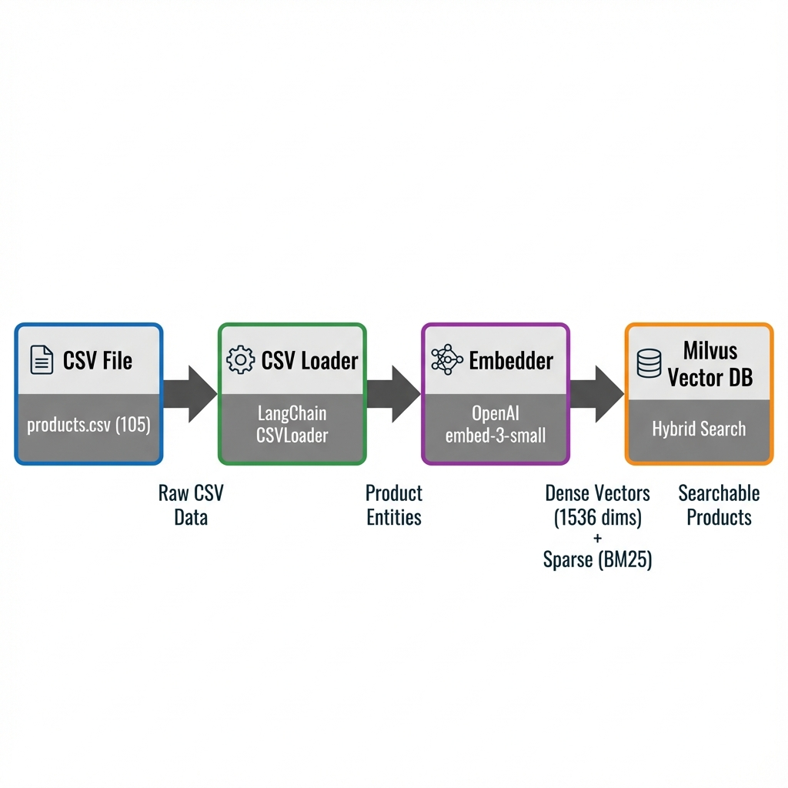
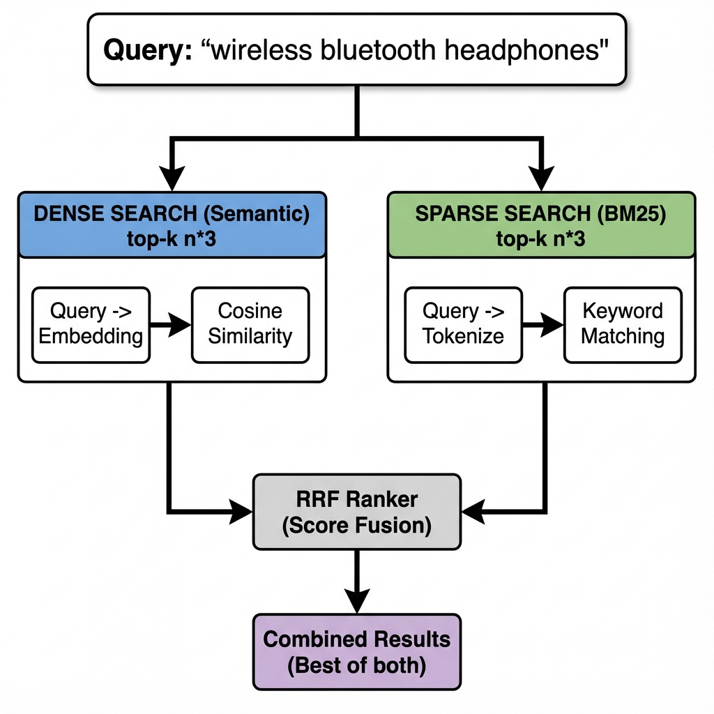
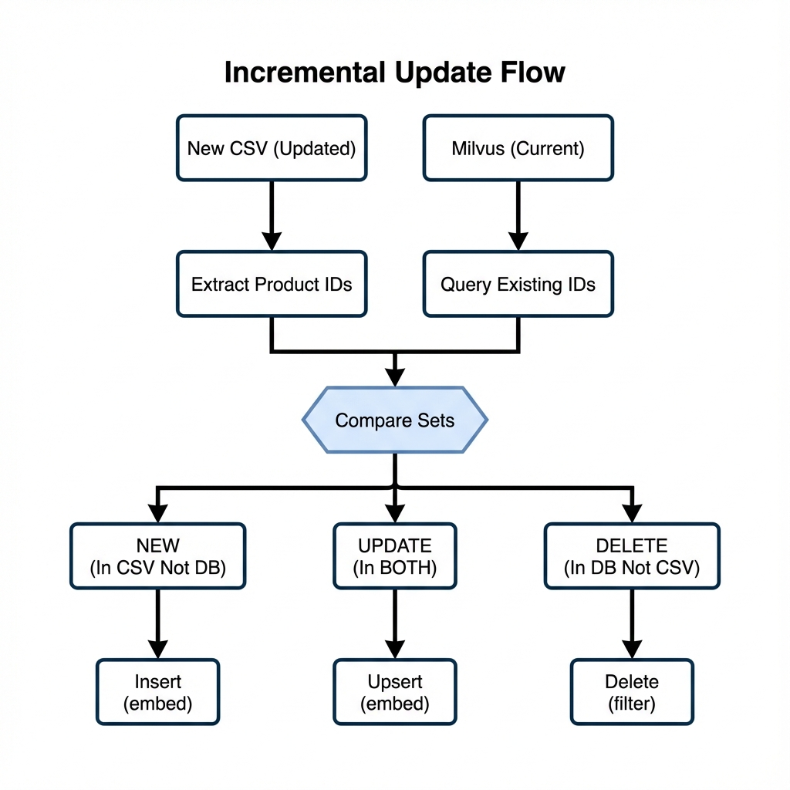

# Data Pipeline Architecture

## Overview

The Data Pipeline is used to load product data from CSV files into the Milvus Vector Database to support Semantic Search and Hybrid Search in the AI Product Research Assistant system.



---

## Pipeline Components

### 1. CSV Product Loader (`loader.py`)

**Role**: Reads CSV files and converts them into Product entities.

**Input**: `data/products_catalog.csv`

```python
# Supported CSV Columns
- product_id       # Product Code (Primary Key)
- product_name     # Product Name
- category         # Category
- brand            # Brand
- description      # Product Description
- current_price    # Selling Price
- cost             # Cost
- stock_quantity   # Stock Quantity
- monthly_sales    # Monthly Sales
- average_rating   # Average Rating (1-5)
- review_count     # Review Count
- supplier         # Supplier
- last_updated     # Last Updated Date
```

**Technology Stack**:
- LangChain `CSVLoader` for CSV parsing
- Python `dataclass` for Product entity
- Date parsing for `last_updated` field

---

### 2. Product Embedder (`embedder.py`)

**Search Text Generation** (1 product = 1 embedding):

```python
def to_search_text(self) -> str:
    return f"{self.product_id}. {self.name}. {self.description}. Brand: {self.brand}. Category: {self.category}."
```
example output: 
"12345. Product Name. Product Description. Brand: Brand Name. Category: Category Name." 

**Features**:
- **Batch Processing**: Process one batch at a time (default: 100 items)
- **Rate Limiting**: Delay 0.1s between batches to avoid rate limit
- **Async Support**: Supports async/await

---

### 3. Data Ingester (`ingester.py`)

**Role**: Orchestrates the entire pipeline and manages Milvus connection.

**Ingestion Modes**:

| Mode | CLI Command | Description | Use Case |
|------|-------------|---------|----------|
| **Smart Sync** | `--sync` | Auto-detect: Full reload if DB is empty, otherwise Incremental | Daily use, Monthly updates |
| **Force Full** | `--full` | Delete all existing data and reload | Data reset, Schema change |

---

## Milvus Vector Database

### Collection Schema

**Collection Name**: `products`

**Fields**:

| Field | Type | Description |
|-------|------|-------------|
| `product_id` | VARCHAR(50) | Primary Key |
| `search_text` | VARCHAR(4096) | Text for BM25 search |
| `dense_embedding` | FLOAT_VECTOR(1536) | OpenAI embedding |
| `sparse_embedding` | SPARSE_FLOAT_VECTOR | Auto-generated BM25 |
| `name` | VARCHAR(256) | Product name |
| `category` | VARCHAR(100) | Category filter |
| `brand` | VARCHAR(100) | Brand filter |
| `description` | VARCHAR(4096) | Full description |
| `price` | FLOAT | Selling price |
| `cost` | FLOAT | Cost price |
| `stock_quantity` | INT64 | Stock level |
| `monthly_sales` | INT64 | Sales volume |
| `average_rating` | FLOAT | Star rating |
| `review_count` | INT64 | Number of reviews |
| `supplier` | VARCHAR(100) | Supplier name |
| `last_updated` | VARCHAR(20) | Last update date |

### Hybrid Search Support



**Dense Search**:
- Uses OpenAI embedding vectors
- Cosine similarity metric
- Captures semantic meaning ("wireless" ≈ "bluetooth")

**Sparse Search**:
- Uses BM25 algorithm
- Keyword matching
- Captures exact matches (product_id, brand names)

**Ranking**: RRF (Reciprocal Rank Fusion)

---

## Incremental Update Strategy

### Monthly Update Process



### Update Logic

### Hash-Based Change Detection Logic

The system uses **Content Hashing** (MD5) to check for detailed content changes instead of relying solely on `last_updated` date.

**Cost Efficiency**:
    *   Product data has many fields (e.g., `price`, `stock`, `monthly_sales`) that change frequently but **do not affect Embedding**.
    *   We will re-embed only when **Searchable Content** (Name, Description, Brand, Category) actually changes.
    *   *Note: Currently, the Incremental Update system will upsert data when the Hash of Searchable Content changes to reduce unnecessary Embedding API calls.*

**Implementation Details**:

1.  **Generates Search Text**: Concatenates important fields for search into a single string.
    ```python
    # src/domain/entities.py
    def to_search_text(self) -> str:
        return f"{self.product_id}. {self.name}. {self.description}. Brand: {self.brand}. Category: {self.category}."
    ```
2.  **Computes Hash**: Creates MD5 Hash from the string above.
    ```python
    # src/domain/entities.py
    def content_hash(self) -> str:
        return hashlib.md5(self.to_search_text().encode()).hexdigest()
    ```
3.  **Compare Process**:

The operation starts by separating data groups (Set Operations) and then checking the Hash:

```python
# 3.1 Separate groups using Set Operations (First Pass)
to_insert_ids = new_ids - existing_ids     # New products (Insert immediately)
to_delete_ids = existing_ids - new_ids     # Deleted products (Delete immediately)
common_ids = new_ids & existing_ids        # Exist in both (Must check Hash next)

# 3.2 Check Hash only for Common group (Second Pass)
# Get existing Hash from Milvus and compare with new Hash from CSV
if new_hash != old_hash:
    to_update_ids.add(pid)    # Hash mismatch → Update (Re-embed)
else:
    unchanged_ids.add(pid)    # Hash match → Skip (Save Tokens)
```

**Example Output**:
```bash
$ uv run python -m src.cli.ingest --sync
Found 105 products. Starting incremental update...
Done! Inserted: 5, Updated: 2, Unchanged: 98, Deleted: 0
```
*In the example: 2 items had content changes so they were updated/re-embedded. The other 98 items were unchanged or only had price/stock changes, so they were not re-embedded.*


---

## File Structure

```
src/
├── application/
│   └── pipeline/
│       ├── __init__.py          # Exports DataIngester
│       ├── embedder.py          # ProductEmbedder class
│       ├── ingester.py          # DataIngester (orchestrator)
│       └── loader.py            # CSVProductLoader class
├── cli/
│   └── ingest.py                # CLI commands
├── domain/
│   └── entities.py              # Product dataclass
└── infrastructure/
    ├── milvus/
    │   ├── client.py            # MilvusClient wrapper
    │   └── schema.py            # ProductCollectionSchema
    └── openai/
        └── embeddings.py        # OpenAIEmbedder
```